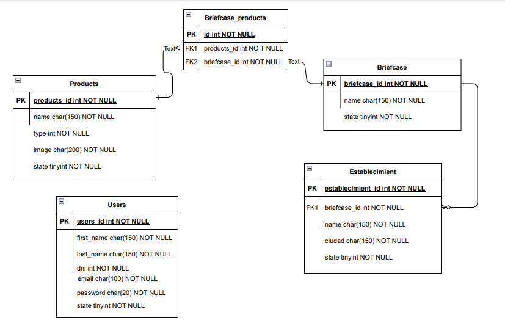

# Prueba tecnica

### Planteamiento del problema

1. Realice un diagrama Entidad-Relación donde resuelva este caso, tenga en cuenta el los
productos, el portafolio, el establecimiento y el usuario.  

2. Realizar API REST donde se puedan realizar las siguientes acciones:
    a. Creación de producto.
    b. Creación de establecimiento.
    c. Creación de portafolio.
    d. Creación de usuario.

3. Se debe hacer uso de JWT para la seguridad y manejo de sesiones, Si se va a usar otro
protocolo de seguridad y manejo de sesiones, se debe especificar y explicar.  

4. ¿Qué infraestructura utilizará para resolver este caso? (Bases de datos relacionales o
documentales, Servidores dedicados o en la nube, protocolos de comunicación).  

5. Si el servicio será utilizado por 12.000 vendedores a nivel nacional, con una disponibilidad
del 99.9999% y el servicio debe funcionar por lo menos de lunes a sábado, ¿Qué medidas
tomaría para garantizar los servicios?.

6. El servicio presentado pasa por una etapa de soporte, donde se resuelven los casos de no
reconocimiento y fallas en el servicio en la aplicación. También, se encuentra la etapa de
analítica, donde se realizan mediciones a gran nivel donde con tableros de control se
toman medidas a nivel gerencial. ¿Qué servicios o herramientas se pueden disponibilizar
para facilitar el trabajo de estas áreas?.

## Soluccion de la prueba

Acontinuacion se abjunta el diagrama ER usado en el diseño para desarrollar la ApiRest. 

El framework selecciona para esta solucion fue [FastApi](https://fastapi.tiangolo.com/), por su rapides, por su libertad al estructurar un proyecto y por su facilidad al validar y documentar una api.

Para hacer uso de este proyecto es necesario clonar el repo y crear un entorno virtual.

~~~ 
>> python -m venv venv 
~~~

Luego se necesita instalar las dependencias del proyecto listada en el archivo **requirements.txt**.

~~~
>> pip install -r requirements.txt
~~~

Para correr el proyecto se debe posicionar en el directorio raiz y correr el seguiente comanzo para lanzar el servidor.

~~~
>> python main.py
~~~

El servidor estara corriendo en la siguiente ruta [FastApi](http://localhost:8000/api)
La documentacion de la api esta construida por el mismo FastApi haciendo uso de swagger [Swagger](https://swagger.io/) implementacion de ***OpenApi***.

Luego de correr el servidor de desarrollo se puede acceder a la documentacion de esta api por el siguiente enlace [api docs](http://127.0.0.1:8000/docs#/).

## Comentarios finales

### Porque usar FastApi y Sqlite

Por medio de este soluccion si bien quedaron muchas validaciones pendiente, trate de poder todo el 100% en realizacion de la misma, decidi trabajar con ***FatsApi*** como framework por su velocidad y por su flexibilidad a la hora de ordenar el codigo tomando en consideracion las necesidades, frente a otras alternativas como ***Django***. Utilice para a base de datos ***sqlite*** por cierto inconvenientes que no me permitieron usar mysql o postgres, pero creo que al momento de desarrolla en ambiente de desarrollo sqlite puede ayudar hacer las cosas mas rapido.

